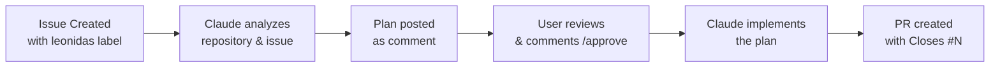

# Leonidas

> Automated issue-to-PR pipeline powered by Claude Code

Leonidas watches for GitHub issues labeled `leonidas`, generates an implementation plan, and upon approval, implements the code and creates a pull request - all automatically.

## How It Works



### Two-Phase Workflow

**Phase 1 - Planning:** When an issue with the `leonidas` label is created, Claude Code analyzes the repository structure and the issue requirements, then posts a detailed implementation plan as a comment.

**Phase 2 - Execution:** When a user comments `/approve` on the issue, Claude Code follows the plan step by step, making atomic commits and creating a pull request that references the issue.

## Quick Start

1. Copy `.github/workflows/plan.yml` and `.github/workflows/execute.yml` to your repository
2. Copy `.github/leonidas.md` (system prompt) to your repository
3. Add `ANTHROPIC_API_KEY` as a repository secret
4. Create an issue with the `leonidas` label
5. Review the plan, then comment `/approve`

See the [Setup Guide](docs/setup-guide.md) for detailed instructions.

## Configuration

Create `leonidas.config.yml` in your repository root to customize:

| Option | Default | Description |
|--------|---------|-------------|
| `label` | `leonidas` | Trigger label name |
| `model` | `claude-sonnet-4-5-20250929` | Claude model to use |
| `branch_prefix` | `claude/issue-` | Branch prefix for PRs |
| `base_branch` | `main` | Base branch for PRs |
| `max_turns` | `30` | Max Claude Code turns |
| `language` | `en` | Plan comment language |

## Project Structure

```
.github/
  workflows/
    plan.yml          # Plan generation workflow
    execute.yml       # Implementation workflow
  leonidas.md         # System prompt for Claude
  ISSUE_TEMPLATE/
    leonidas-request.yml  # Issue template
src/
  config.ts           # Configuration system
  prompts/
    plan.ts           # Plan prompt builder
    execute.ts        # Execute prompt builder
  templates/
    plan-comment.ts   # Comment formatting
leonidas.config.yml   # Example configuration
```

## Limitations

- Requires an Anthropic API key with sufficient credits
- Complex issues may exceed the `max_turns` limit
- Claude may not perfectly follow all existing code conventions
- Large repositories may take longer to analyze

## Contributing

Contributions are welcome! Please see [CONTRIBUTING.md](CONTRIBUTING.md) for guidelines.

## License

[MIT](LICENSE)
